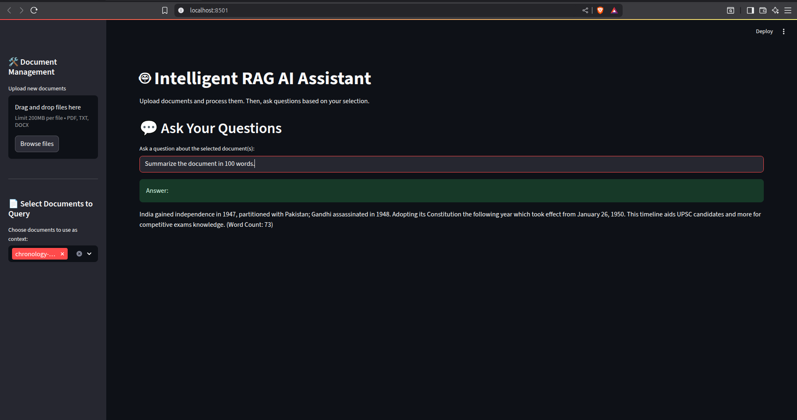

# 🧠 Intelligent RAG AI Assistant

This project is a self-hosted, open-source AI assistant that uses a Retrieval-Augmented Generation (RAG) pipeline to answer questions based on your own documents. It features a user-friendly web interface built with Streamlit, local LLM inference powered by Ollama, and an intelligent document management system.



---

## ✨ Features

-   **Bring Your Own Documents**: Upload PDF, TXT, or DOCX files directly through the web UI.
-   **Intelligent Processing**: The app automatically detects new, unprocessed documents and prompts the user to add them to the knowledge base.
-   **Selective Querying**: Choose which specific documents to use as context for your questions, giving you precise control over the AI's knowledge.
-   **Local & Private**: All components, including the language model (via Ollama), run locally on your machine. Your data never leaves your system.
-   **Open-Source Stack**: Built entirely with powerful open-source tools like LangChain, ChromaDB, and Streamlit.
-   **Query Logging**: Automatically logs all questions and answers to a local SQLite database for analysis and review.

---

## 🏗️ Architecture Overview

The application follows a modular RAG architecture:

```text
User Query + Selected Docs
   │
   ▼
[Frontend (Streamlit)]
   │
   ▼
[RAG Pipeline (LangChain)]
   │     ┌────────────────────────────────────┐
   ├────▶│ Embed Query (Sentence-Transformers)│
   │     └────────────────────────────────────┘
   │
   │     ┌──────────────────────────────────────────────┐
   ├────▶│ Vector Search (ChromaDB with Metadata Filter)│
   │     └──────────────────────────────────────────────┘
   │
   │     ┌────────────────────────┐
   └────▶│ LLM Inference (Ollama) │
         └────────────────────────┘
```

---

## 🛠️ Setup and Installation

Follow these steps to get the project running on your local machine.

### 1. Prerequisites

-   **Python 3.9+**
-   **Docker and Docker Compose**: For running the Ollama LLM server. [Install Docker](https://www.docker.com/products/docker-desktop/).
-   **Poppler**: A system dependency required for parsing PDF documents.
    -   **macOS**: `brew install poppler`
    -   **Debian/Ubuntu**: `sudo apt-get update && sudo apt-get install poppler-utils`
    -   **Windows**: [Download Poppler binaries](https://github.com/oschwartz10612/poppler-windows/releases/), extract them, and add the `bin` folder to your system's PATH.

### 2. Clone the Repository

```bash
git clone https://github.com/harshad208/rag_assistant.git
cd rag-assistant
```
**Note:** Replace `your-username/rag-assistant.git` with the actual URL of your repository.

### 3. Set Up Python Environment

Create and activate a virtual environment:

```bash
# For macOS and Linux
python3 -m venv venv
source venv/bin/activate

# For Windows
python -m venv venv
.\venv\Scripts\activate
```

Install the required Python packages:

```bash
pip install -r requirements.txt
```

### 4. Start the Backend Services

This project uses Docker Compose to run the Ollama server. From the root of the project directory, run:

```bash
docker-compose up -d
```

After the server is running, pull a language model. We recommend `phi-3` for a good balance of performance and size.

```bash
docker exec -it ollama ollama pull phi-3
```

---

## 🚀 How to Use

1.  **Launch the Streamlit App:**
    ```bash
    streamlit run app/main.py
    ```

2.  **Upload Documents:**
    -   The application will open in your browser.
    -   Use the **"Upload new documents"** widget in the sidebar to add your files.

3.  **Process Documents:**
    -   The app will automatically detect any unprocessed files.
    -   Click the **"Process New Documents"** button in the sidebar to embed them and add them to your vector knowledge base.

4.  **Ask Questions:**
    -   Once processed, your documents will appear in the **"Select Documents to Query"** list.
    -   Select one or more documents to set the context.
    -   Ask a question in the chat input and get a context-aware answer!

---

## 📁 Project Structure

```
rag-assistant/
│
├── app/
│   ├── main.py               # Streamlit UI and application logic
│   ├── rag_chain.py          # RAG pipeline setup with LangChain
│   ├── embed_store.py        # Document ingestion and embedding logic
│   └── database_utils.py     # SQLite database for query logging
│
├── data/                     # Source documents (ignored by git)
│
├── db/                       # Databases (ignored by git)
│
├── docker-compose.yml        # Docker config for Ollama
├── requirements.txt
├── .gitignore
└── README.md
```# rag_assistant
